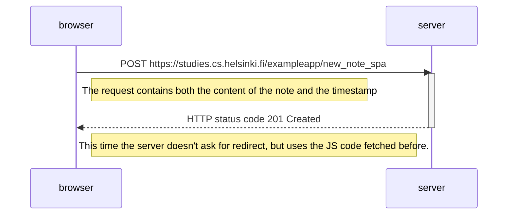

```mermaid
sequenceDiagram
    participant browser
    participant server

    browser->>server: POST https://studies.cs.helsinki.fi/exampleapp/new_note_spa
    activate server
    Note right of browser: The request contains both the content of the note and the timestamp
    server-->>browser: HTTP status code 201 Created
    deactivate server
    Note right of browser: This time the server doesn't ask for redirect, but uses the JS code fetched before.
```